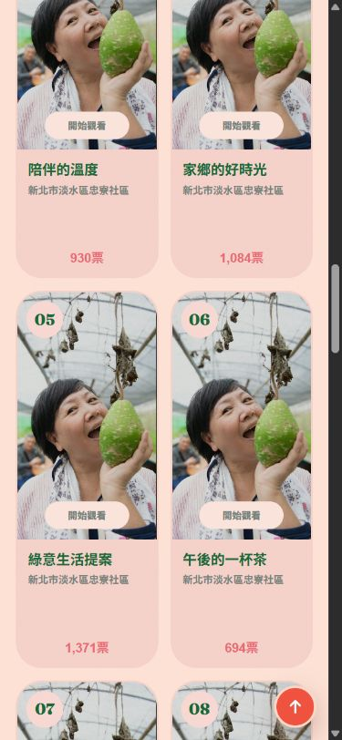
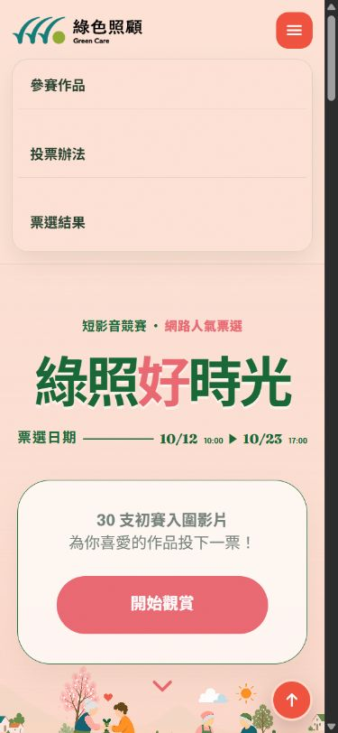
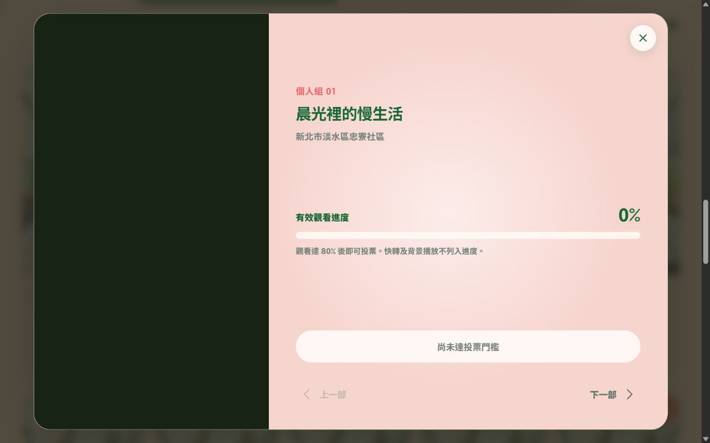

# GreenCare 現行系統遷移基準

## 1. 基準資訊

- 建立日期：2026-09-17
- 基準分支：`codex/migrate-vue-dotnet-sqlserver`
- 基準 commit：`ca2d95c`
- 現行技術：原生 HTML/CSS/JavaScript、Node.js 22、Express 5、SQLite／better-sqlite3
- 本機網址：`http://127.0.0.1:3000/`
- 測試結果：`npm test` 共 5 項，5 項通過、0 項失敗
- 瀏覽器檢查：首頁、影片 Dialog、手機導覽及結果頁皆無 console error／warning

本文件作為 Vue／.NET 改寫的功能、API 及視覺比對依據。除非使用者另行核准，新版不得任意更改以下外觀、文案、路徑或行為。

## 2. 視覺基準

### 桌面首頁，1265 × 791


### 手機首頁，375 × 812



### 手機導覽展開，375 × 812



### 桌面影片 Dialog，1265 × 791



### 桌面結果頁，1265 × 791


### 響應式基準

- 作品卡桌面預設 5 欄。
- 1100px 以下為 4 欄。
- 800px 以下進入平板／手機導覽及 Dialog 版型。
- 520px 以下作品卡為 2 欄，頁尾改為單欄。
- 結果頁 900px 以下改為單欄分組。
- 主要字型為 Epilogue、Noto Sans TC 與 Fraunces fallback。
- 主色為深綠 `#176735`、珊瑚紅 `#EA6872`／`#f0523e`、淡粉底 `#fde2d5`。

## 3. 頁面與操作基準

### 首頁 `/`

- 頂部導覽：參賽作品、投票辦法、票選結果。
- Hero 顯示競賽名稱、票選日期、30 支影片及「開始觀賞」。
- 投票辦法顯示：每組 2 票、觀看 80%、同作品不重複、截止前可改投。
- 個人組及團體組以頁籤切換，各 15 支作品。
- 作品卡顯示作品編號、海報、狀態、片名、團隊／單位及即時票數。
- 顯示目前已投票數及剩餘票數。
- 首頁顯示兩組前三名摘要，每 30 秒更新。

### 影片 Dialog

- 左側／上方為 9:16 YouTube 播放器，右側／下方為作品資訊。
- 顯示組別、編號、片名、單位、有效進度百分比及進度條。
- 未達 80% 時投票按鈕停用，文字為「尚未達投票門檻」。
- 顯示「快轉及背景播放不列入進度」。
- 可切換上一部／下一部；第一部的上一部按鈕停用。
- 可使用關閉按鈕或 ESC 關閉。

### 投票確認 Dialog

- 寬度上限 500px，淡粉背景、深綠文字、圓角及半透明深色 backdrop。
- 顯示「投票確認」eyebrow、動態標題、動態確認內容與狀態圖示。
- 一般投票顯示「返回」及「確認投票」。
- 改投時標題與主要按鈕改為「確認改投」，內容同時顯示原作品及新作品。
- 取消投票使用相同 Dialog 的 cancel tone，主要色改為深綠。
- 520px 以下兩個按鈕改為單欄，主要按鈕排列在前。
- 本階段以 HTML/CSS 與前端事件流程記錄結構基準；實際投票確認流程已由 API 測試涵蓋，待新版投票 UI 階段進行完整視覺及人工操作驗收。

### 手機導覽

- 以漢堡按鈕開啟／關閉。
- 展開後依序顯示參賽作品、投票辦法、票選結果。
- `aria-expanded` 隨展開狀態更新。

### 結果頁 `/results.html`

- 顯示活動期間、即時／正式狀態、最後更新時間及非最終結果聲明。
- 個人組及團體組各顯示第一名大卡及第 2–15 名清單。
- 點擊作品可回到首頁並開啟對應作品。
- 排名每 30 秒更新。

## 4. 公開 API 契約

所有 JSON request 使用 `Content-Type: application/json`。一般錯誤格式為：

```json
{ "error": "使用者可閱讀的錯誤訊息" }
```

### `GET /api/bootstrap`

成功：`200 OK`，首次呼叫會設定 `vote_device` Cookie。

```json
{
  "videos": [{
    "id": 1,
    "number": "01",
    "title": "晨光裡的慢生活",
    "team": "暖陽創作",
    "youtubeId": "YLi5uuy5bw4",
    "poster": "images/posters/individual-demo.jpg",
    "category": "individual"
  }],
  "votes": [{
    "id": 1,
    "videoId": 1,
    "category": "individual",
    "status": "valid",
    "createdAt": "ISO-8601"
  }],
  "progress": [{
    "videoId": 1,
    "ratio": 0.8,
    "qualified": 1
  }],
  "limits": { "individual": 2, "team": 2 },
  "remaining": { "individual": 2, "team": 2 },
  "activity": {
    "state": "upcoming|active|ended",
    "startsAt": "ISO-8601 UTC",
    "endsAt": "ISO-8601 UTC"
  },
  "recaptchaSiteKey": "",
  "demo": false
}
```

Cookie 基準：

- 名稱：`vote_device`
- 內容：`UUID.HMAC`
- `Max-Age=31536000`
- `Path=/`
- `HttpOnly`
- `SameSite=Lax`
- `NODE_ENV=production` 時包含 `Secure`
- 裝置 `last_seen_at` 最多每 5 分鐘更新一次。

### `POST /api/watch/start`

Request：

```json
{ "videoId": 1, "duration": 120.5 }
```

成功：`200 OK`

```json
{ "sessionId": "UUID.HMAC", "reused": false }
```

- 同裝置、同影片、片長相差小於 2 秒且 30 分鐘內活躍時重用 Session，`reused` 為 `true`。
- 影片不存在、片長非數字、小於 10 秒或大於 7200 秒：`400`。
- IP 每分鐘最多 120 次，裝置每分鐘最多 12 次；超限為 `429` 並含 `Retry-After: 60`。

### `POST /api/watch/progress`

Request：

```json
{
  "sessionId": "UUID.HMAC",
  "position": 15.2,
  "playbackRate": 1,
  "playing": true,
  "visible": true,
  "event": "tick|transition"
}
```

一般成功：

```json
{ "ratio": 0.25, "qualified": false }
```

可能附加：

```json
{ "throttled": true }
```

或：

```json
{ "restarted": true }
```

- Session 無效或不屬於目前裝置：`404`。
- 非 transition 且距上次回報少於 3 秒時回傳現況並加上 `throttled`。
- 只有 `playing=true`、`visible=true`、播放速度 `0 < rate <= 1.25`，且影片位置變化合理時累積。
- 單次伺服器 wall time 最多計 10 秒。
- 有效秒數／片長達 0.8 時設定永久資格。
- IP 每分鐘 600 次、裝置每分鐘 60 次、Session 每分鐘 20 次；超限為 `429`。

### `POST /api/votes`

Request：

```json
{
  "videoId": 1,
  "recaptchaToken": "token",
  "deviceSignal": "client-generated-signal"
}
```

成功：`201 Created`

```json
{ "id": 1, "status": "valid|flagged" }
```

- 非投票期間：`403`。
- CAPTCHA 失敗：`403`。
- 未觀看 80%、同作品重複或同組已滿兩票：`409`。
- 資料庫併發 constraint：`409`。
- 裝置每分鐘 10 次、IP 每分鐘 30 次；超限為 `429`。

### `POST /api/votes/{id}/replace`

Request 與新增投票相同，`videoId` 為新作品。

成功：`201 Created`

```json
{ "id": 2, "status": "valid|flagged" }
```

- 找不到屬於目前裝置的 active 原票：`404`。
- 跨組改投：`400`。
- 新作品未取得資格、重複票或票數衝突：`409`。
- 新增新票及取消原票使用同一個 transaction；失敗時原票保留。

### `DELETE /api/votes/{id}`

成功：`200 OK`

```json
{ "ok": true }
```

- 非投票期間：`403`。
- 找不到屬於目前裝置的 active 票：`404`。
- 取消採狀態異動，保留原始投票紀錄及 `cancelled_at`。

### `GET /api/results`

成功：`200 OK`，Header 為 `Cache-Control: private, max-age=5`。

```json
{
  "published": false,
  "live": true,
  "generatedAt": "ISO-8601 UTC",
  "activity": {
    "state": "active",
    "startsAt": "ISO-8601 UTC",
    "endsAt": "ISO-8601 UTC"
  },
  "groups": {
    "individual": [{
      "id": 1,
      "number": "01",
      "title": "晨光裡的慢生活",
      "team": "暖陽創作",
      "youtubeId": "YLi5uuy5bw4",
      "poster": "images/posters/individual-demo.jpg",
      "category": "individual",
      "votes": 0,
      "rank": 1
    }],
    "team": []
  }
}
```

- 只統計 `status='valid'`。
- 先依票數降冪，再依作品 ID 升冪。
- 伺服器共用 5 秒快取；新增、取消、改投或作廢時失效。

## 5. 核心業務規則

- 作品共 30 支：個人組 ID 1–15、團體組 ID 16–30。
- 每個裝置在每組最多同時持有 2 張 active 票。
- 同裝置對同作品最多 1 張 active 票。
- `valid` 與 `flagged` 都占用裝置票額；只有 `valid` 列入結果。
- 使用者可取消或同組改投；新作品仍需先取得 80% 觀看資格。
- `cancelled` 及 `void` 保留作稽核，不直接刪除。
- IP 不作為唯一身分，只用於限流及風險計分。
- 風險分數達 60 時票標記為 `flagged`。
- 未取得資格且建立超過 24 小時、又未被投票引用的觀看 Session 會被清理。

## 6. 已確認的既有差異與注意事項

### 活動期間依環境分離

使用者已於 2026-09-17 確認，開發／測試與正式環境採用不同活動期間。

開發／測試環境為方便反覆驗證，使用全年開放：

- 開始：2026-01-01 00:00（Asia/Taipei）
- 結束：2026-12-31 23:59:59（Asia/Taipei）

正式環境依活動需求使用：

- 開始：2026-10-12 10:00（Asia/Taipei）
- 結束：2026-10-23 17:00（Asia/Taipei）

新版實作時必須以環境設定分離，不得共用活動期間：

- `Development`／本機測試：全年開放，允許開發人員透過本機設定覆寫。
- `Production`：固定使用 2026-10-12 10:00 至 2026-10-23 17:00（Asia/Taipei）。
- Production 啟動與部署驗收必須檢查正式日期，避免誤用 Development 設定。
- 密鑰與實際正式設定不得提交 Git；Repository 只保存不含密鑰的設定範例及驗收規則。

### 未納入新版的隱藏管理功能

Repository 目前存在 `/admin.html`、`/api/admin/summary` 及 `/api/admin/votes/{id}/void`，但使用者已確認網站沒有正式管理後台，因此不列入新版公開功能及遷移範圍。

### 目前測試覆蓋限制

- 現有自動化測試共 5 項，集中在投票上限、重複票、取消、改投交易、觀看 Session 重用、限流及倒轉行為。
- 尚無前端自動化視覺測試、Cookie 安全屬性測試、正式 CAPTCHA 測試或完整 30 秒更新測試。
- 這些缺口須在後續對應階段補齊，不能以現有 5 項測試通過視為新版完整驗收。
